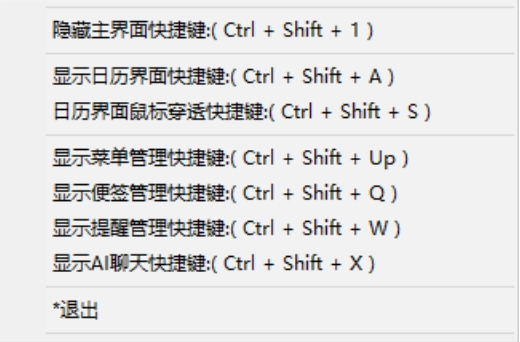

#### 介绍

个人桌面小工具 有标签 桌面日历  提醒 程序快捷启动等功能  
做为一个码农,找了好长时间没有找到一个用好的工具，就自己写了一个。
主要功能 有

## 1 快捷方式管理

     把图标或者文件目录 托进去就是增加了一个快捷方式

## 2 便签管理

    有时一些常用的东西 用记事本记着 多了忘记保存到那里 干脆就加了个这功能  相当一个统一的入口 可以快速的检索

## 3 桌面日历

## 4 提醒

其他的功能 目前正在慢慢加

有好的建议，可以留言

# 主界面

# 日历界面

# 便签界面

# 提醒界面

 

# 任务栏菜单界面

# 设置界面

