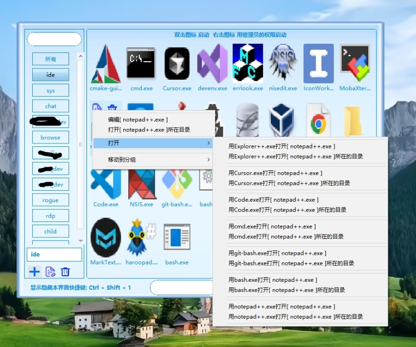
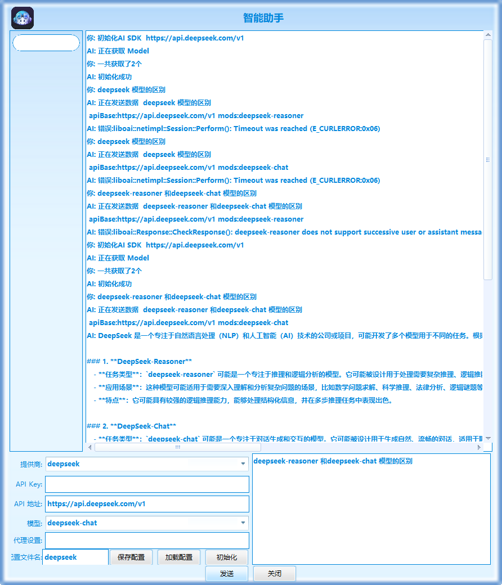

# 个人桌面小工具介绍
源自 由于想要一个便签和提醒还有桌面日历以及图标快速启动的工具.找了好久没有找到,可能是我自己的见识少.
做为一个码农,然后就干脆自己写了一个。
个人桌面小工具 有标签 桌面日历  提醒 程序快捷启动等功能
主要功能 请看下面

## 版本信息
版本查看 打开设置界面看以看到 
当前软件版本信息: 2025-02-04 14:49:40(1738651780)
## 
## 1.快捷方式管理
     把图标或目录 托进去就是增加了一个快捷方式

## 2.便签管理
    有时一些常用的东西 用记事本记着 多了忘记保存到那里 干脆就加了个这功能  相当一个统一的入口 可以快速的检索

## 3. 桌面日历

## 4.提醒

## 5.AI聊天对话
增加了 openai   deepseek 的API
**主支持 自定义的openai的服务器 提供商选 myopenai
填写好 api key 和 api地址后 点初始化就可以了
可以把当前的配置 保存 下用 点 加载配置就可以了

## 6.设置界面

## 7.托盘右键

# 设置界面

gitee: [https://gitee.com/zuzong/my-desk-toolsmyDeskTools/](https://gitee.com/zuzong/my-desk-toolsmyDeskTools/)  
github: [https://github.com/poorboy/desktools/](https://github.com/poorboy/desktools/)

其他的功能 目前正在慢慢加

有好的建议，可以留言

